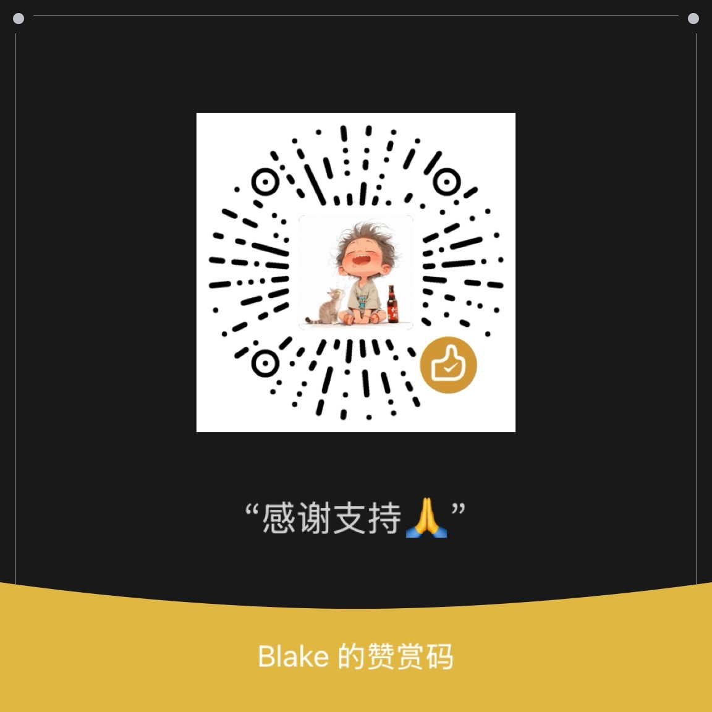

# 🌙 NianNian (念念)

> **Love remembered. Never forgotten.**

[](LICENSE)
[](CONTRIBUTING.md)
[](https://blakeya.github.io/niannian)
[](PRIVACY.md)

A Lunar Birthday Calendar helper — put your family's birthdays into your calendar, with automatic reminders every year.

---

## 📖 The Story

I forgot my mom's birthday again.

Not because I don't care. Her birthday is on the 15th day of the 8th month of the Chinese lunar calendar - a date that falls on a different Gregorian calendar day every year. Last year it was September 29th. This year it's October 6th. Next year it will be September 25th again. You can't just set a yearly recurring event in Calendar.app - it follows the Gregorian calendar.

I wanted to record lunar birthdays in my iPhone calendar, but couldn't find a simple, good-looking solution:

- **Python scripts**? My parents can't use those.
- **Third-party apps**? Data is locked inside. What if I switch phones?
- **Existing web tools**? Manual input one by one, no batch support, UI from 2010.

So I built my own.

**NianNian** is a **pure frontend, zero-privacy-risk, free, and open-source** lunar birthday tool.

---

## 🔒 Privacy Commitment

```
┌────────────────────────────────────────────────┐
│                                                │
│  NianNian is a 100% client-side tool           │
│                                                │
│  ✅ Your data never leaves your device         │
│  ✅ No server, no database, no API             │
│  ✅ All computation happens in your browser    │
│  ✅ No CDN, no remote fonts, no analytics      │
│  ✅ Download the HTML and use it offline       │
│  ✅ Fully open source, auditable code          │
│                                                │
└────────────────────────────────────────────────┘
```

> **Your family's names and lunar birthdays belong only to you and your device.**

---

## 💡 The Solution

NianNian does one thing: takes your family's lunar birthday list and **generates a standard `.ics` calendar file**.

```
① Open the web page (or double-click the HTML file)
② Enter lunar birthdays (upload CSV or type in the table)
③ Click "Generate & Download"
④ Open the .ics file → Import into your calendar app
⑤ iCloud syncs to all your devices
```

From then on, every lunar birthday and its countdown events appear automatically in your calendar — no notification setup needed.

---

## ✨ Features

### ✅ v1

| Feature | Description |
|---|---|
| **CSV Import** | Drag-and-drop CSV upload, auto-dedup by name |
| **Inline Editing** | Add/edit/delete rows directly in the browser table |
| **ICS Generation** | One-click standard `.ics` file (compatible with Apple/Google/Outlook) |
| **60+ Years** | Pre-computes all lunar→Gregorian dates for 10/30/60/100 years |
| **Custom Reminders** | Per-person config: days before, once/daily/every-other-day. Each reminder day generates a separate calendar event, visible on your calendar |
| **Privacy First** | Zero-server, all computation in-browser, nothing uploaded |
| **Offline Ready** | Download the HTML file and use it without internet |
| **Import Guide** | Built-in instructions for Mac / iPhone / iPad |
| **Local Persistence** | Data saved in localStorage, survives page reload |
| **GitHub Pages** | Hosted at `blakeya.github.io/niannian` |

### 🔮 v2 (In Progress)

| Status | Feature | Description |
|---|---|---|
| ✅ Done | **PWA Immersive** | Safe-area, status-bar, splash screen, add to home screen |
| ✅ Done | **Sample Data** | Pre-filled demo data on first visit |
| ✅ Done | **Bilingual** | Chinese/English toggle |
| ✅ Done | **Responsive Redesign** | Mobile card-list + bottom sheet, desktop table + CSV upload dual views |
| 🔄 WIP | **Tags/Groups** | Label birthdays (family/friends), export by group |
| 📋 Planned | **Import Enhancement** | CSV preview, validation, better error messages |
| 📋 Planned | **Chinese Numerals** | Support input like "八月十五" |

### 🌌 v3 (Future)

- Multi-calendar export with group labels
- Custom calendar name
- Additional calendar systems (Tibetan, Islamic, etc.)
- Batch operations (multi-select, drag-to-reorder, copy-paste rows)

---

## 🚀 Quick Start

1. Open `index.html` in any browser (or visit the GitHub Pages site)
2. Upload a CSV or type birthdays directly in the table
3. Set reminder preferences for each person
4. Click "Generate ICS & Download"
5. Double-click the downloaded `.ics` file → Calendar.app opens → choose "New Calendar" named "念念·Lunar Birthdays"
6. Countdown events appear on your calendar automatically:
   - N days before: `"Mom's Birthday · 3 days"` / `"Dad's Birthday · tomorrow"`
   - On the day: `"🎂 Mom's Birthday"`
7. Done! iCloud syncs to iPhone and iPad automatically

**To update**: Modify the list on the web page → regenerate → delete old calendar → import new file. Takes 30 seconds.

---

## 📂 CSV Format

```csv
name,lunarMonth,lunarDay,note,daysBefore,mode
Mom,8,15,Lunar Aug 15,3,once
Dad,5,5,Lunar May 5,7,daily
Grandma,12,23,Lunar Dec 23,7,daily
```

| Field | Required | Description |
|---|---|---|
| `name` | ✅ | Name, shown as event title |
| `lunarMonth` | ✅ | Lunar month (1-12) |
| `lunarDay` | ✅ | Lunar day (1-30) |
| `note` | | Optional, shown in event details |
| `daysBefore` | | Days before to start reminding (default 1) |
| `mode` | | Reminder mode: `once` / `daily` / `everyOtherDay` (default `once`) |

**Reminder mechanism:**

> ⚠️ **Important**: Apple Calendar ignores VALARM blocks from imported ICS files. Instead of relying on VALARM, NianNian generates **separate all-day events** for each reminder day — reminders appear directly on your calendar.

| Mode | Effect | Example (3 days before) |
|---|---|---|
| `once` | Birthday only | `🎂 Mom's Birthday` |
| `daily` | One event per day, from N days before through birthday | `Mom's Birthday · 3 days` → `· 2 days` → `· tomorrow` → `🎂 Mom's Birthday` |
| `everyOtherDay` | One event every other day | `Mom's Birthday · 5 days` → `· 3 days` → `· tomorrow` → `🎂 Mom's Birthday` |

**Calendar appearance (3 days before · daily):**
```
May 10  → Mom's Birthday · 3 days     ← visible on calendar
May 11  → Mom's Birthday · 2 days     ← visible on calendar
May 12  → Mom's Birthday · tomorrow   ← visible on calendar
May 13  → 🎂 Mom's Birthday           ← visible on calendar
```

> 💡 **Notifications**: Each event is an all-day event. iOS will fire the default all-day event notification at the time configured in Settings > Calendar > Default Alert Times (9:00 AM by default).

---

## 🏗️ Architecture

All in a single HTML file. No build step, no dependencies, no server.

**Key design decisions:**

| Decision | Choice | Rationale |
|---|---|---|
| Architecture | **Single HTML file** | Offline-ready, auditable, trivial to deploy |
| Lunar conversion | `solarlunar` **inlined** | Zero network requests, covers 1900-2100 |
| CSS | **Hand-written** | No Tailwind CDN dependency, privacy-focused |
| Persistence | `localStorage` | Survives page refresh, 100% offline |
| Reminder mechanism | **Separate calendar events** (not VALARM) | Apple Calendar ignores VALARM on import; separate all-day events are visible in the calendar and trigger iOS default notifications |

```
niannian/
├── index.html         ← The entire app (HTML + CSS + JS inlined)
├── sw.js              ← Service Worker for offline caching
├── manifest.json      ← PWA manifest
├── icon-192.png       ← App icon
├── icon-512.png
├── sample.csv         ← Sample CSV template
└── LICENSE            ← MIT
```

---

## ☕ Buy Me a Coffee

If this tool helps you, feel free to scan the QR code to buy me a coffee ☕  
No pressure, totally voluntary. Thanks for every kindness ❤️

<p align="center">
  
</p>

---

## ⚖️ License

[MIT](LICENSE). Free to use, modify, and distribute.

### Third-party Dependencies

| Library | Purpose | License |
|---|---|---|
| [solarlunar](https://github.com/yize/solarlunar) (yize) | Lunar/Solar calendar conversion | [ISC](https://opensource.org/licenses/ISC) |

---

## 🌟 Contributing

PRs and issues welcome! See [CONTRIBUTING.md](CONTRIBUTING.md).

Made with ❤️ because family birthdays matter.

> **Love remembered. Never forgotten.**
